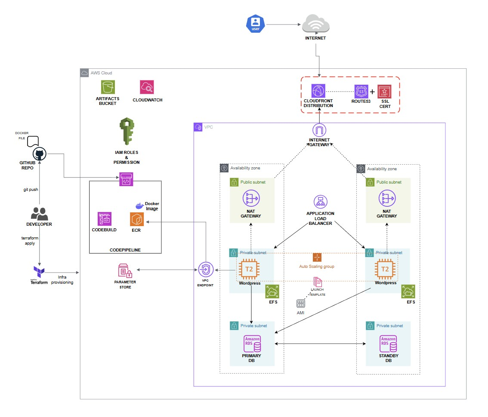

# Wordpress Blog Web App

A highly available and scalable WordPress application hosted on AWS with infrastructure as code. This production-grade deployment features auto-scaling, multi-AZ resilience, and comprehensive security measures.

---

## Features

This project demonstrates a real-world, production-grade cloud application with:

- High Availability: Multi-AZ deployment across 3 availability zones

- Auto-scaling: EC2 instances automatically scale based on traffic

- Managed Database: Multi-AZ RDS MySQL instance for data durability

- Global CDN: CloudFront distribution for worldwide low-latency access

- Secure Architecture: Private subnet deployment with controlled ingress

- Persistent Storage: EFS for shared WordPress content

- Infrastructure as Code: Complete Terraform deployment

- Dockerized: Containerized WordPress for consistent deployments

- Zero-Downtime Updates: Rolling deployments with instance refresh

---

## Architecture Diagram

---

## Infrastructure Components

- VPC with public and private subnets across 3 AZs

- NAT Gateway for outbound internet access from private instances

- Internet Gateway for public-facing resources

---

## Compute Layer

- Auto Scaling Group with EC2 instances in private subnets

- Pre-baked AMI with Docker, EFS utils, and AWS CLI

- Docker containers running WordPress with Apache

- Launch Template for consistent instance configuration

---

## Storage & Database

- Amazon RDS MySQL with multi-AZ deployment

- Amazon EFS for shared WordPress content storage

- EFS Access Points for consistent file permissions

---

## Networking & security

- Application Load Balancer with SSL termination

- CloudFront CDN for global content delivery

- Security Groups for granular traffic control

- VPC Endpoints for private AWS service access

- Route 53 for DNS management (external)

---

## Management & Operations

- AWS Systems Manager for instance management

- Parameter Store for secure configuration

- CloudWatch for monitoring and logging

- IAM Roles for secure access control

---

## Prerequisites

- AWS Account with appropriate permissions

- Terraform v1.0+ installed

- AWS CLI configured with credentials

- Domain name registered (or use Route 53)

- SSL Certificate in ACM (for HTTPS)

## Quickstart

### Clone the repository
git clone https://github.com/patrickneil03/Blogwordpressapp.git
cd wordpress-blog-app

### Initialize Terraform
terraform init

### Plan the deployment
terraform plan

# Apply the infrastructure
terraform apply

# Get the CloudFront URL
terraform output cloudfront_url